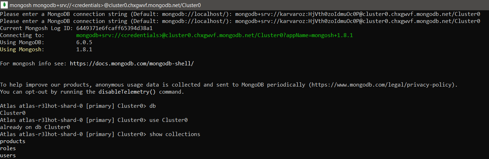
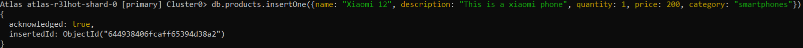
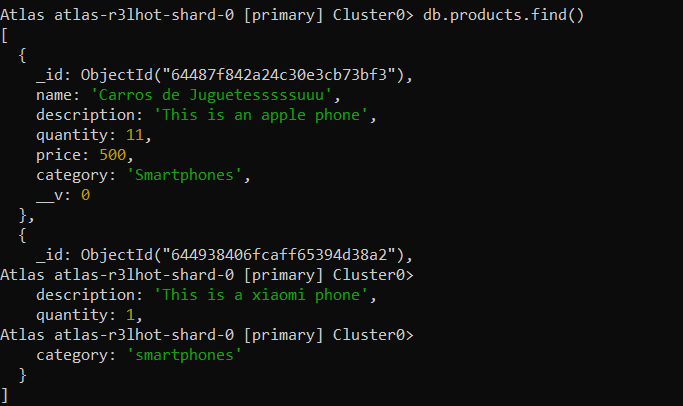
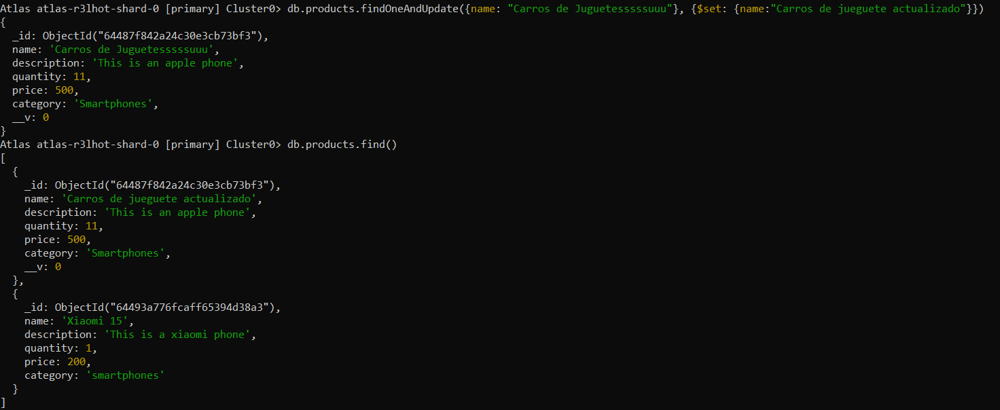
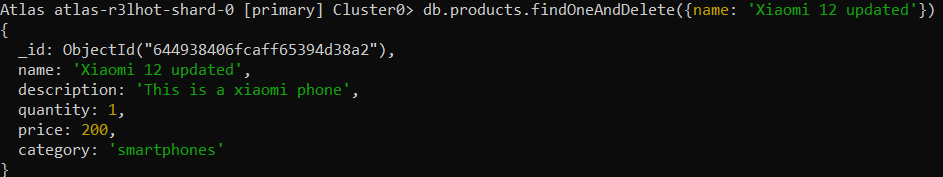
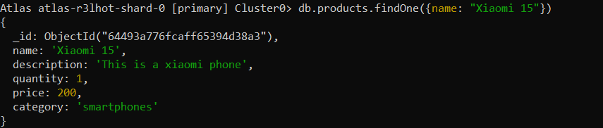

# MONGO SHELL QUERIES

Mongo Command: db

- List databases

Mongo Command: use Cluster0

- Select database

Mongo Command: show collections

- Show all collections in the database

Mongo Command: db.products.insertOne({name: "Xiaomi 12", description: "This is a xiaomi phone", quantity: 1, price: 200, category: "smartphones"})

- Insert a new document to the collection

Mongo Command: db.products.find()

- List all documents in the collection

Mongo Command: db.products.findOneAndUpdate({name: "Carros de Juguetesssssuuu"}, {$set: {name:"Carros de jueguete actualizado"}})

- Update a document in the collection

Mongo Command: db.products.findOneAndDelete({name: 'Xiaomi 12 updated'})

- Delete a document from the collection matching the specified field

Mongo Command: db.products.findOne({name: "Xiaomi 15"})

- Find a document matching the specified field
